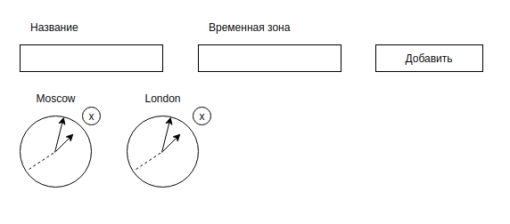

Мировые часы

Наверняка вы видели в офисах многих компаний установленные часы, показывающие время в разных столицах мира:
* New York,
* Moscow,
* London,
* Tokyo.

Общая механика:

1. Вы заполняете поля «Название» и «Временная зона», указываете смещение в часах относительно Гринвича и нажимаете кнопку «Добавить».
2. Часы автоматически добавляются и, что самое важное, начинают тикать, то есть отсчитываются секунды, минуты и часы.
3. При нажатии на крестик рядом с часами часы автоматически удаляются, при этом все подписки — `setTimeout`, `setInterval` и другие — должны вычищаться в соответствующем методе жизненного цикла.

Упрощения: если вам сложно реализовать механику со стрелками через css — см. `transform` и `rotate()`, то вы можете сделать цифровые часы, где отображаются только цифры в формате: ЧЧ:ММ:СС.

Подсказки:
1. Посмотреть текущий TimezoneOffset вы можете, используя объект `Date`.
1. Можете использовать библиотеку Moment.js.
